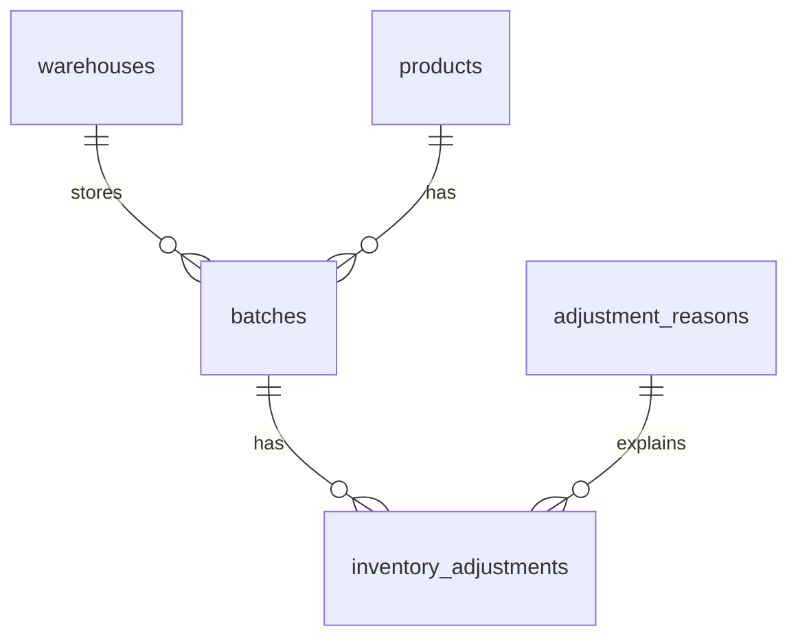

# 库存调整 API

[English](README.md) | 简体中文

一个独立的 Laravel API 演示项目，用于通过预定义原因调整仓库批次的库存数量。每次调整都会记录原数量、盘点后的数量、差值、原因和可选备注。调整记录与批次数量在同一个数据库事务中保存。

例如：系统记录某批次有 **100** 件商品，实物盘点发现只有 **92** 件。API 会记录 **100 → 92**、差值 **−8** 和所选原因，并将批次库存更新为 **92**。

## 环境要求

- **PHP 8.4.1–8.5.x**，已在 PHP 8.5.0 上验证。虽然项目根目录的 Composer 版本约束从 PHP 8.3 开始，但已提交的锁文件包含要求 PHP 8.4.1 或更高版本的 Symfony 依赖，其他已锁定依赖目前支持的版本上限为 PHP 8.5。
- **Composer 2**。
- **MySQL 8.4 / InnoDB**，已在 MySQL 8.4.11 上验证。
- PHP 的 **PDO MySQL 扩展**以及 Composer 要求的其他扩展。并发测试还需要 PHP CLI 支持启动子进程（`proc_open`）。

项目使用 Laravel 13 和 PHPUnit 12。运行 API 和测试无需构建前端，也不需要 Node.js、Redis 或队列工作进程。

## 安装与运行

所有命令都应在包含 `artisan` 和 `composer.json` 的项目目录下执行。以下示例使用 POSIX shell，例如 macOS 终端或 Linux shell。

### 1. 安装依赖并创建本地配置

首次获取项目后执行：

```bash
composer install --no-interaction
composer check-platform-reqs
php --ri pdo_mysql
cp .env.example .env
php artisan key:generate --no-interaction
```

更新已经配置好的项目时，应保留现有 `.env` 和应用密钥。使用 `composer install` 按 `composer.lock` 安装依赖，以保持版本与本项目一致。

### 2. 创建数据库

使用有建库权限的账号连接 MySQL，执行：

```sql
CREATE DATABASE IF NOT EXISTS inventory_adjustment
    CHARACTER SET utf8mb4 COLLATE utf8mb4_unicode_ci;

CREATE DATABASE IF NOT EXISTS inventory_adjustment_testing
    CHARACTER SET utf8mb4 COLLATE utf8mb4_unicode_ci;
```

在 `.env` 中配置一个现有 MySQL 账号。该账号需要能在这两个数据库中读写数据，以及创建、修改和删除表。下面的 `inventory_app` 只是示例账号名；应用不会自动创建数据库账号或授予权限。

```dotenv
APP_URL=http://127.0.0.1:8001
DB_CONNECTION=mysql
DB_HOST=127.0.0.1
DB_PORT=3306
DB_DATABASE=inventory_adjustment
DB_USERNAME=inventory_app
DB_PASSWORD="your-local-database-password"
DB_URL=
DB_SOCKET=
```

请填写自己 MySQL 服务的实际端口、用户名和密码。配置模板使用 MySQL 常用端口 **3306**；作者现有的本地环境使用 **13306**。真实凭据应保存在 `.env` 中，该文件已被 Git 忽略。

### 3. 建表、填充演示数据并启动 API

```bash
php artisan config:clear --no-interaction
php artisan migrate --seed --no-interaction
php artisan serve --host=127.0.0.1 --port=8001 --no-interaction
```

保持该终端运行。API 基础地址为 `http://127.0.0.1:8001/api/v1`，Laravel 健康检查地址为 `http://127.0.0.1:8001/up`。

Migration 会创建五张业务表和 Laravel 默认的辅助表。独立测试数据库的迁移由测试程序管理。

## 演示数据

在空数据库中首次执行 Seed，会创建 **2 个仓库、2 个商品、2 个批次、6 个原因，不创建调整记录**。

| 批次 | 商品 | 仓库 | 初始数量 |
| --- | --- | --- | ---: |
| `BATCH-001` | `MOUSE-001` — Wireless Mouse | Shanghai Warehouse | 100 |
| `BATCH-002` | `KEYBOARD-001` — Mechanical Keyboard | Guangzhou Warehouse | 50 |

| 原因名称 | 类型 | 已启用 | 可用于新增库存调整 |
| --- | --- | --- | --- |
| Physical count correction | `inventory_adjustment` | 是 | 是 |
| Damaged items | `inventory_adjustment` | 是 | 是 |
| Missing items | `inventory_adjustment` | 是 | 是 |
| Data entry correction | `inventory_adjustment` | 是 | 是 |
| Retired physical count reason | `inventory_adjustment` | 否 | 否 |
| Order cancellation | `order_cancellation` | 是 | 否 |

在全新的空数据库中，`BATCH-001` 的 ID 为 `1`，四个可用原因的 ID 为 `1`–`4`。已有数据库中的 ID 可能不同；必要时通过原因列表接口获取原因 ID，并查看数据库中已填充的批次。

重复执行 `php artisan db:seed --no-interaction` 不会重复插入标准演示数据、重置已调整的库存，或重新启用手动停用的原因。它不会将演示数据恢复到初始状态。

## API

所有接口均返回 JSON。请求应携带 `Accept: application/json`；POST 请求还需要 `Content-Type: application/json`。成功的资源响应使用顶层 `data` 字段。身份认证不在这个独立演示项目的范围内，接口可直接访问。

| 方法 | 路径 | 成功响应 |
| --- | --- | --- |
| GET | `/api/v1/adjustment-reasons` | `200` — 可用原因列表 |
| POST | `/api/v1/inventory-adjustments` | `201` — 新建的调整记录及关联信息 |
| GET | `/api/v1/inventory-adjustments/{inventoryAdjustment}` | `200` — 调整记录及关联信息 |

### 查询可用原因

```bash
curl -sS http://127.0.0.1:8001/api/v1/adjustment-reasons \
  -H 'Accept: application/json'
```

```json
{
  "data": [
    {"id": 1, "name": "Physical count correction"},
    {"id": 2, "name": "Damaged items"},
    {"id": 3, "name": "Missing items"},
    {"id": 4, "name": "Data entry correction"}
  ]
}
```

只返回已启用且类型为 `inventory_adjustment` 的原因，按 ID 排序。没有符合条件的原因时，返回 `{"data":[]}`。

### 创建库存调整

`new_quantity` 表示**盘点后的实际总数量**，而不是要增加或减少的数量。

| 字段 | 规则 |
| --- | --- |
| `batch_id` | 必填整数；批次必须存在 |
| `reason_id` | 必填整数；原因必须存在、已启用，且类型为 `inventory_adjustment` |
| `new_quantity` | 必填整数，范围为 `0` 到 `4294967295` |
| `note` | 可选、允许为 `null` 的字符串；最多 1,000 个字符 |

```bash
curl -i -X POST http://127.0.0.1:8001/api/v1/inventory-adjustments \
  -H 'Accept: application/json' \
  -H 'Content-Type: application/json' \
  -d '{
    "batch_id": 1,
    "reason_id": 1,
    "new_quantity": 92,
    "note": "Morning physical count"
  }'
```

在刚完成 Seed 的数据库中首次调整时，`201 Created` 响应示例：

```json
{
  "data": {
    "id": 1,
    "batch_id": 1,
    "reason_id": 1,
    "old_quantity": 100,
    "new_quantity": 92,
    "quantity_difference": -8,
    "note": "Morning physical count",
    "batch": {
      "id": 1,
      "batch_number": "BATCH-001",
      "quantity": 92,
      "product": {"id": 1, "name": "Wireless Mouse", "sku": "MOUSE-001"},
      "warehouse": {"id": 1, "name": "Shanghai Warehouse"}
    },
    "reason": {"id": 1, "name": "Physical count correction"}
  }
}
```

服务端从已锁定的批次读取 `old_quantity`，并计算 `quantity_difference = new_quantity - old_quantity`。客户端提交的旧数量、差值或调整记录 ID 都不会被采用。空备注会转换为 `null`，字符串首尾的空白会被去除。

### 查看调整详情

使用 POST 响应中返回的调整记录 ID：

```bash
curl -i http://127.0.0.1:8001/api/v1/inventory-adjustments/1 \
  -H 'Accept: application/json'
```

响应结构与创建接口相同。`old_quantity`、`new_quantity` 和 `quantity_difference` 描述这次历史调整；`batch.quantity` 是批次的**当前数量**，可能在这次调整之后发生过变化。历史记录中的原因即使后来被停用或改为其他类型，仍然可以查看。

### 错误响应

- **422**：输入验证失败，包括原因不可用或数量不合法。不会创建调整记录，库存保持不变。
- **404**：请求的调整记录不存在。如果批次在请求验证通过后、事务内查询之前被删除，也会返回 404。
- 写入调整记录或更新库存时发生异常，事务会回滚。未预期的异常会作为服务器错误返回。

当 `new_quantity` 为 `-1` 时，错误响应示例：

```json
{
  "message": "The new quantity must be at least 0.",
  "errors": {
    "new_quantity": ["The new quantity must be at least 0."]
  }
}
```

`errors` 下的字段名标识哪个输入不合法。多个字段同时验证失败时，顶层 `message` 的具体文本可能不同。

## 自动化测试

先按上述步骤创建 `inventory_adjustment_testing`，再执行：

```bash
php artisan config:clear --no-interaction
php artisan test --compact
```

测试使用**真实 MySQL**，并发场景会启动两个独立 PHP 进程。MySQL 必须处于运行状态，无需启动开发 HTTP 服务器。

`phpunit.xml` 强制使用 MySQL 连接和数据库名 `inventory_adjustment_testing`。主机、端口和凭据读取本地环境配置。基础测试类和并发工作进程都会先检查数据库，再继续执行。测试会重建或清理专用测试库，因此该库只能存放可丢弃的测试数据。请串行运行测试：由于数据库名固定，不支持 `--parallel`，也不支持多个测试任务同时使用同一个数据库。

已验证结果：**56 条测试用例通过，312 个断言**，包括 54 条业务测试和 2 条框架示例测试。

| 测试类 | 覆盖场景 |
| --- | --- |
| `StoreInventoryAdjustmentTest` | 创建调整、数量增加/减少/归零/不变、数值边界、可选备注、非法输入、英文验证提示、不可用原因、服务端计算字段、连续调整，以及不影响其他批次 |
| `ListAdjustmentReasonsTest` | 启用状态和类型过滤、输出字段、排序、空列表 |
| `ShowInventoryAdjustmentTest` | 关联批次/商品/仓库/原因、404、历史数量和原因 |
| `InventoryAdjustmentTransactionTest` | 每次写入后的异常回滚；初次验证后原因或批次发生变化时重新检查，包括原因不可用时的英文提示 |
| `InventoryAdjustmentConcurrencyTest` | 两个竞争请求正确形成 `100 → 92 → 90` 的调整记录 |
| `DemoSeederTest` | 演示数据完整、关联正确、重复填充不产生重复数据或重置库存 |

只运行创建调整相关测试：

```bash
php artisan test --compact --filter=StoreInventoryAdjustmentTest
```

## 数据表结构

五张业务表定义在 [database/migrations](database/migrations) 中。下表列出 MySQL 数据类型，省略 Laravel 默认的辅助表。

每张业务表都有自增主键 `id`（`BIGINT UNSIGNED`），以及由 Eloquent 维护、允许为 `NULL` 的 `created_at` / `updated_at`（`TIMESTAMP`）。其余字段中，只有 `inventory_adjustments.note` 允许为 `NULL`。



每个批次属于且仅属于一个仓库和一个商品。每条调整记录属于且仅属于一个批次和一个原因。仓库、商品、批次或原因都可以先存在，再创建与其关联的子记录。

### `warehouses`

| 字段 | MySQL 类型 | 用途 / 约束 |
| --- | --- | --- |
| `name` | `VARCHAR(100)` | 仓库显示名称，例如 `Shanghai Warehouse` |

### `products`

| 字段 | MySQL 类型 | 用途 / 约束 |
| --- | --- | --- |
| `name` | `VARCHAR(100)` | 商品显示名称，例如 `Wireless Mouse` |
| `sku` | `VARCHAR(64)` | 商品编号，在所有商品中唯一 |

### `batches`

| 字段 | MySQL 类型 | 用途 / 约束 |
| --- | --- | --- |
| `batch_number` | `VARCHAR(64)` | 批次编号，在所有批次中唯一 |
| `warehouse_id` | `BIGINT UNSIGNED` | 外键，关联 `warehouses.id` |
| `product_id` | `BIGINT UNSIGNED` | 外键，关联 `products.id` |
| `quantity` | `INT UNSIGNED` | 当前库存数量，默认值为 `0` |

### `adjustment_reasons`

| 字段 | MySQL 类型 | 用途 / 约束 |
| --- | --- | --- |
| `name` | `VARCHAR(100)` | 预定义原因的显示名称，例如 `Physical count correction` |
| `type` | `VARCHAR(50)` | 适用业务，例如 `inventory_adjustment` 或 `order_cancellation` |
| `is_active` | `TINYINT(1)` | 表示是否启用的布尔值，默认值为 `true` |

### `inventory_adjustments`

| 字段 | MySQL 类型 | 用途 / 约束 |
| --- | --- | --- |
| `batch_id` | `BIGINT UNSIGNED` | 外键，关联 `batches.id` |
| `reason_id` | `BIGINT UNSIGNED` | 外键，关联 `adjustment_reasons.id` |
| `old_quantity` | `INT UNSIGNED` | 本次调整前的库存数量快照 |
| `new_quantity` | `INT UNSIGNED` | 本次调整采用的实物盘点数量快照 |
| `quantity_difference` | `BIGINT`（有符号） | 应用计算的差值：`new_quantity - old_quantity` |
| `note` | `TEXT`，允许为 `NULL` | 可选的补充说明；API 限制最多 1,000 个字符 |

四个外键都使用 `ON DELETE RESTRICT`，阻止删除仍被引用的记录。`quantity`、`old_quantity` 和 `new_quantity` 的范围为 `0` 到 `4294967295`；有符号差值可以表示这一完整范围内的增加和减少。

应用会在请求验证和事务内再次检查原因是否已启用，且类型是否为 `inventory_adjustment`。原因可用性、备注长度限制和差值计算由应用实现，并非数据库的 `CHECK` 约束或生成列。

## 设计决策

- **五张业务表。** 一个仓库或商品可以关联多个批次，每个批次属于一个仓库和一个商品。每条调整记录关联一个批次和一个预定义原因。外键限制删除仍被引用的数据。
- **预定义原因。** `type` 决定原因适用的业务，`is_active` 决定能否用于新的调整。自由文本备注用于补充说明，不能替代 `reason_id`。
- **库存变更的原子性。** 在同一事务中通过 `lockForUpdate()` 锁定所选批次、读取当前数量、插入调整记录并更新库存。写入失败时，两项变更一起回滚。
- **重新验证原因。** 在事务内部再次检查所选原因，并使用 `sharedLock()` 读取。这能处理初次验证之后发生的变化，并防止所选原因在事务结束前被修改。
- **整数数量。** 库存数量使用无符号整数；差值使用有符号 `BIGINT`，确保 `0 → 4294967295` 及其反向变化都能记录且不会溢出。
- **简单的 Laravel 结构。** Form Request 验证输入，Controller 协调数据库操作，Eloquent Model 表达关联，API Resource 定义响应格式。输出前显式加载关联数据。这三个接口无需额外引入 Service 或 Repository 层。
- **历史记录与当前状态。** 调整前后的数量作为快照保存。关联名称和批次当前数量从现有关联记录读取，没有复制成完整的历史快照。项目没有提供修改或删除调整记录的接口。
- **实际总数量与重复请求。** 允许提交与当前数量相同的数量，并记录差值为零的调整。每次 POST 都会创建新记录；请求去重、幂等处理和过期盘点结果检测不在本演示项目范围内。行锁保证数量变更记录的一致性，但不能判断哪份结果来自更晚的实物盘点。

## 项目结构

```text
app/Http/Controllers/   API 请求处理
app/Http/Requests/      输入验证
app/Http/Resources/     JSON 响应格式
app/Models/            Eloquent 模型与关联
database/migrations/   数据库表结构
database/seeders/      可重复执行的演示数据填充
database/factories/    测试数据
routes/api.php         带版本前缀的 API 路由
tests/Feature/         API、事务、并发和 Seed 测试
```
